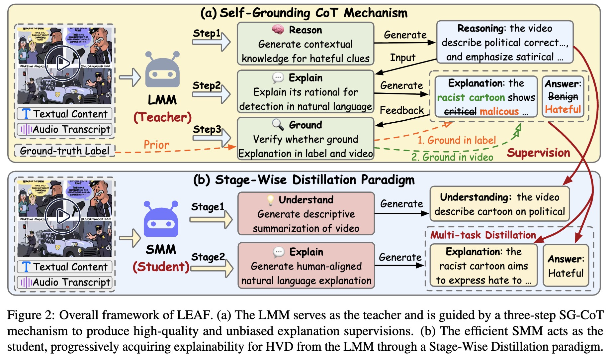

# LEAF: Lightweight Explainable hAteful video detection Framework via Self-Grounding Chain-of-Thought

This repo provides an official implementation of LEAF as described in the paper: *LEAF: Towards Lightweight Explainable Hateful Video Detection via Self-Grounding CoT Guided Stage-Wise Distillation*, which is accepted by ACL 2026 Findings.

## Abstract

The rapid spread of hateful videos online has sparked growing social concerns, driving research efforts to detect and limit their dissemination. However, existing methods rely on opaque models that offer no insight into their decisions, eroding trust in detection systems. Large Multimodal Models (LMMs) provide a compelling alternative, thanks to their ability to generate free-text explanations for multimodal content. Yet, their high computational demands and pronounced bias toward benign predictions limit their practicality. We introduce LEAF, the first Lightweight, Explainable hAteful video detection Framework. At its core, LEAF distills the "explainability" from LMMs into efficient Smaller Multimodal Models (SMMs) through a controlled, de-biasing process, enabling lightweight yet interpretable Hateful Video Detection (HVD). We achieve this with a novel Self-Grounding Chain-of-Thought mechanism that guides LMMs to generate high-quality, unbiased explanatory supervision signals for videos. These signals then progressively train the SMM via a new Stage-Wise Distillation paradigm, resulting in faithful, human-readable natural language explanations for HVD. Extensive experiments on three video benchmarks demonstrate that LEAF not only outperforms prior methods in detection accuracy but also provides strong explainability - all with a lightweight design.

## Framework



## Dataset
We use three datasets for our experiments. Due to copyright restrictions, the raw datasets are not included. You can obtain the datasets from their respective project sites:

+ [HateMM](https://github.com/hate-alert/HateMM)
+ [MHClip-Y](https://github.com/social-ai-studio/multihateclip)
+ [MHClip-B](https://github.com/social-ai-studio/multihateclip)


## Source Code Structure

```sh
├── data        # dataset folder
│   ├── HateMM
│   ├── MHClipEN
│   └── MHClipZH
├── distill     # code of SG-CoT
│   └── generate_dataset 
├── pipeline    # code of dual-stage distillation
│   ├── cfg     # config of distillation
│   ├── evaluate.py
│   ├── finetune.py
│   ├── main.py # entrance of fine-tuning
│   └── utils
├── README.md
└── requirements.txt
```

## Usage

### Requirement

To set up the environment, run the following commands:

```sh
conda create --name LEAF python=3.12
conda activate LEAF
pip install -r requirements.txt
```

### Preprocess

1. Download datasets and store them in `data` presented in Source Code Structure, and save videos to `videos` and in corresponding dataset path.
2. For video dataset, save `data.jsonl` in each dataset path, with each line including vid, title, ocr, transcript, and label. And evenly sample 16 frames for each video store in `data/{dataset}/frames_16`.

### Run

#### Step1: SG-CoT to Generate Supervised Data

```sh
# generate supervised data using qwen2.5-vl-72b-instruct
python distill/generate_dataset/generate_knowledge.py --dataset HateMM # generate on HateMM dataset
python distill/generate_dataset/generate_knowledge.py --dataset MHClipEN # generate on MHClipEN dataset
python distill/generate_dataset/generate_knowledge.py --dataset MHClipZH # generate on MHClipZH dataset
```

#### Step2: Dual-Stage Distillation

```sh
# for qwen2.5-vl-3b-instruct distillation
python pipeline/finetune.py --config-name pipeline/cfg/HateMM_explain_reason.yaml     # distill on HateMM dataset
python pipeline/finetune.py --config-name pipeline/cfg/MHClipEN_explain_reason.yaml     # distill on MHClip-Y dataset
python pipeline/finetune.py --config-name pipeline/cfg/MHClipZH_explain_reason.yaml     # distill on MHClip-B dataset
``` 

## Citation

If you find the code useful for your research, please give us a star ⭐⭐⭐ and consider citing:

```
@inproceedings{lang2026leaf,
  title = {LEAF: Towards Lightweight Explainable Hateful Video Detection via Self-Grounding CoT Guided Stage-Wise Distillation},
  author = {Lang, Jian and Hong, Rongpei and Zhong, Meihui and Li, Kaiju and Zhong, Ting and Gao, Qiang and Zhou, Fan},
  booktitle = {Findings of the Association for Computational Linguistics: ACL 2026},
  year = {2026}
}
```